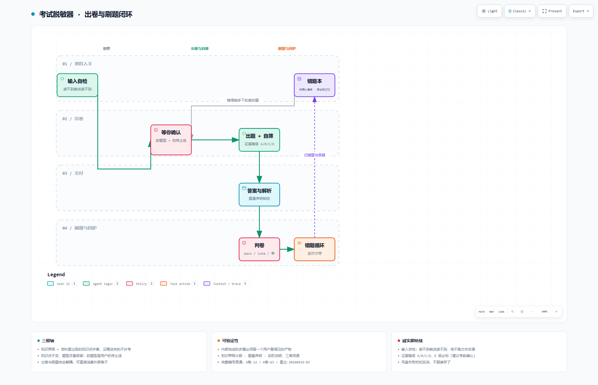

# 设计说明

> 这份文档讲**为什么这么设计**。怎么装、怎么用、有哪些限制，见 [README](../README.md)。

*上图：`docs/workflow.html` 的静态预览。交互版（明暗主题、缩放、搜索、导出）下载该 HTML 后双击打开。*

---

## 一、起点不是学习工具，是考试焦虑

这个项目最早解决的不是"怎么学得更好"，而是**"怎么不那么怕"**。

高考那种贯穿高三的压力，很多人进了大学都还没卸下来。到了要考试的时候——不一定是期末——症状是很具体的：

- 看着一门课的 PPT 和课本，**不知道从哪下手**——不是懒，是"要学的东西看起来没有边界"
- 复习到最后**没有停止线**——"我是不是还漏了什么"永远无法回答
- 于是要么弃疗，要么临时抱佛脚、拼命不希望挂科，**刷了题还是觉得没刷够**

所以这个工具的验收标准不是"让你考高分"，而是：

> **哪怕这一科没考好，你还能觉得下一科可以考好。**

它要造的不是练习题，是**可预期性**。

（顺带一提：它天生带剂量调节——错得越多，下一轮加权加题越多。所以它不只服务考前一天，也能当阶段性的复习计划用：**短突击和长复习走的是同一套机制，只是轮数不同**。但它只是引擎，不排日程、不管进度。）

---

## 二、核心的一次偷换

焦虑的燃料是未知——**"老师会考什么"**。

这个工具**不预测考题**。它做的是把未知的考场**替换成已知的考场**：

> 卷子只能从你自己的资料里长出来。所以**你必须知道它会考什么，因为它只能考那些。**

这个偷换带来一条重要的设计取向：

| | 不追求 | 追求 |
|---|---|---|
| 目标 | 押中率 | **可预期性** |
| 依据 | 模型觉得什么重要 | **你的资料里有什么** |
| 失败模式 | 没押中 | **让你误信一份编造的卷子** |

一份"我们知道它只能考这些"的卷子，比一份"押中率很高但你不知道它靠不靠得住"的卷子更有价值——**因为后者会制造错误的确定感**。

---

## 三、三根轴

全部模式共用这三条，任何设计取舍都要让位于它们。

**1. 知识界限 = 资料里出现的知识点的并集。**
不是章节边界，是知识点集合。推论很硬：**没喂进来的，不许考；喂进来的，不许漏记。**

这条也解释了为什么工具必须诚实面对"资料残缺"。多数课根本没有完整 PPT，课本常常不是同一本，往年卷基本拿不到（大学不返卷）。**残缺是常态，不是例外。** 资料实在没有时，正确答案是告诉用户"这份卷子只能当安慰剂"，而不是假装有依据。

**2. 知识点不变，题型尽量保留。**
变的是皮——措辞、情境、选项顺序；不变的是知识点。用户明确说不要某题型才砍它，**因为那是他给自己划的停止线，不是需要被优化的参数**。

**3. 出卷与刷题完全解耦。**
刷题可以直接消费本工具出的卷子，也可以消费你从别处拿来的任何卷子或题库。

---

## 四、四种模式

| 模式 | 输入 | 输出 | 关键约束 |
|---|---|---|---|
| **出卷** | 残缺资料（PPT / 课本 / 题库 / 口述） | 卷子 + 答案解析 + 考点清单 | **必须先提大纲、等确认，才出卷** |
| **刷题** | 一份已有卷子 | 逐题陪练 + 错题循环 | **只当考官，不当老师** |
| **知识点直出** | 一串知识点的名字 | 逐题陪练 + 错题循环 | **不要求先交资料**——这是最低门槛的入口 |
| **建科** | 用户的科目信息 | 该科的规格文件 | **只在用户明确要求时执行** |

四个模式的详细规则在 `exam-forge/references/` 下，按需加载。

**为什么拆成文件而不是塞进一个 SKILL.md**：想做某件事的模型，不该被迫读完整份文档。入口只留路由和原则。

---

## 五、可验证性：内部步骤必须留痕

这个工具里有几步是**纯内部活动、没有任何产物**的——比如"从资料里抽出知识点集合"。问题是：

> 模型要是跳过了这一步、直接开始编题，**从卷面上完全看不出来**。出来的卷子一样工整，而这一步恰恰是整份卷子的地基。

所以定了条通行做法：**凡是内部完成的步骤，都要留一个用户看得见的产物。**

| 内部活动 | 可见产物 |
|---|---|
| 从资料抽出知识界限 | 一行计数：「抽出 87 个可考知识点、检出 2 处来源冲突、3 个章节无任何来源」 |
| 确定题量 | 题量声明：「合计 34 题 100 分」——**给"不许擅自缩题"装上牙** |
| 错题加权 | 一行说明：「基础 34 题之外，追加 4 题（Ch5 +2、Ch9 +2）」 |

这些产物**不改变内部流程**，只是让它**可被验证**。

配套的还有**编号命名空间**：题目来自多个来源，裸题号会串号，所以统一用 `卷次-题号`（`A卷-12` / `A卷-W3` / `直出-20260919-03`）——落盘、排序、历史回溯一律用完整编号。

---

## 六、诚实即防线

这是整个工具最重要的一条规则，比任何格式都重要。

**1. 输入自检。**
有些资料读不到——比如图片型 PPT 遇上没有视觉能力的模型。这时最危险的不是报错，是"**看起来读到了**"：顺着文件名猜内容，出来的卷子像模像样，其实全是编的。

规则是：**先验证自己真的读到了内容；读不到就立刻说读不到；绝不根据文件名推测知识点。**

**2. 证据等级。**
每道题的答案和解析都带等级：

| 等级 | 含义 |
|:---:|---|
| **A** | 资料原文可直接引用（给出处） |
| **B** | 从资料直接推导 |
| **C** | 来自公开题库或同类教材（给来源） |
| **D** | **模型生成，资料里没有依据** —— 解析开头必写「⚠️建议考前确认」 |

**绝不能伪造引用。** 在没有原文的情况下写「（教材原题）」「（课本原文：……）」是被明令禁止的。

理由很简单：**一份伪造引用的解析，比一份没有解析的卷子危险得多——它会让你带着错误的确定感进考场。**

**3. 写盘失败必须说。**
错题本、待确认清单、规格都是文件。环境只读时，工具**仍然可以出卷和刷题**，只是退化成没有记忆的一次性用法——**这没问题，前提是用户知道**。

所以规则是：**不产生文件却宣布写入成功，是这个工具最严重的一类失败。**

---

## 七、两个反直觉的设计

**1. 不给建议，只报事实。**
刷题时，答完只输出"正确答案 + 逐项解析 + 下一题"。不写"答对了"、不写"别灰心"、不报进度、不做总结。

用户是临考的人。**他做题时唯一的敌人是题本身，任何多余输出都是噪音。**

唯一的例外：同一道题连续答错 ≥3 次时，允许给一次 **≤50 字**的极简速查。

**2. 允许不完美地结束。**
这个工具必须能被半途放下——一份没刷完的卷子、一次没跑完的错题循环，**都不该变成新的失败证据**。

因为"我还没准备好"本身就是焦虑的核心燃料。一个用来准备考试的工具，天然会强化"我准备得还不够"。**做得越用力，越可能制造新的焦虑。** 这是它最需要避开的陷阱。

---

## 八、它不承诺什么

说清楚比藏着好。

- **它不押题，也不保证你考高分。** 它保证的是开考那一刻你不再慌。
- **它替代不了理解，也替代不了上课。** 它给你的是熟悉感和启动成本，不是掌握。刷题产生的"我很熟"和"我真的会了"在体感上很难区分——**别把状态当终点**。
- **技能包没有安装器。** 它只是一段文字加一次 AI 判断。换个弱模型，可能出现"跳过确认直接出卷""不去读 specs"这类**悄悄跑偏**，而不是报错。
- **主观题不自动判分。** 简答、论述给参考答案和采分点，算不算错由使用者自己说。
- **它不是心理治疗、不是心理咨询**，也不构成任何专业心理健康建议。如果你正经历持续的情绪困扰，请寻求专业帮助。

---

## 九、一句话

**它不保证你考好，它保证你不再是走进考场才发现自己一无所知的那个人。**
